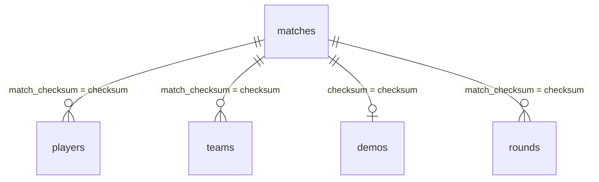

# Schéma PostgreSQL `csdemo` — référence HelloView

Ce document décrit les tables et colonnes **effectivement utilisées** (ou utiles) par **HelloView** : dashboard, API `/api/stats`, `/api/match`, filtres brackets, overlays, téléchargement de démos. La base est en pratique alimentée par [**CS Demo Manager**](https://github.com/akiver/cs-demo-manager) ; les noms de tables/colonnes peuvent varier légèrement selon la version d’export — vérifier avec `npm run inspect-db` ou `scripts/inspect-schema.sql`.

---

## Sommaire

1. [Vue d’ensemble des relations](#vue-densemble-des-relations)  
2. [Table `matches`](#table-matches)  
3. [Table `players`](#table-players)  
4. [Table `teams`](#table-teams)  
5. [Table `demos`](#table-demos)  
6. [Table `rounds`](#table-rounds)  
7. [Table `steam_account_overrides`](#table-steam_account_overrides)  
8. [Requêtes et calculs côté application](#requêtes-et-calculs-côté-application)  
9. [Téléchargement des fichiers `.dem`](#téléchargement-des-fichiers-dem)  
10. [Inspection et export](#inspection-et-export)

---

## Vue d’ensemble des relations

- Un **match** est identifié par **`matches.checksum`** (souvent appelé **checksum** ou **match_checksum** ailleurs).
- **`players.match_checksum`** et **`teams.match_checksum`** rattachent lignes joueurs / équipes à ce match.
- **`demos.checksum`** joint la métadonnée « fichier démo analysé » au même identifiant que **`matches.checksum`** (clé de jointure typique : `demos.checksum = matches.checksum`).
- **`matches.winner_name`** est le **nom textuel de l’équipe gagnante** ; il sert au calcul W/L agrégé par équipe sur le dashboard lorsque les données viennent de l’API (en complément ou à la place de logiques basées uniquement sur `players.wins_count`).

---

## Table `matches`

Enregistrement **un par match analysé** (une ligne par checksum).

| Colonne | Type usuel | Rôle pour HelloView |
|---------|------------|---------------------|
| **`checksum`** | `text` / `varchar` | **Identifiant canonique du match** ; égal aux `match_checksum` dans `players` / `teams` ; utilisé comme **`id`** des objets `matches` dans l’API JSON. |
| **`winner_name`** | `text` | Nom de l’équipe gagnante (ex. tel qu’affiché dans le jeu ou normalisé par l’outil d’analyse). **Source de vérité** pour victoires / défaites par équipe au niveau match dans les agrégations du dashboard. |
| **`winner_side`** | entier | Côté gagnant (ex. CT / T selon convention du schéma source). Peut servir pour affichage ou analyses futures ; le front actuel s’appuie surtout sur `winner_name`. |
| **`analyze_date`** | `timestamptz` | Date/heure d’analyse ; sert au **tri** des matchs et aux **libellés** de secours (« Match N · date ») si le nom issu de `demos` est absent. |
| **`demo_path`** | `text` | Chemin **absolu ou UNC** du fichier `.dem` côté machine qui a analysé le match (ex. `\\serveur\partage\80_match_de_map.dem`). HelloView n’utilise que le **dernier segment** (nom de fichier) pour le rapprochement avec les fichiers placés sous **`data/demo/`** sur le serveur web (voir README, section démos). |
| **`game_type`**, **`game_mode`**, **`game_mode_str`** | divers | Contexte de partie (ex. `competitive`) ; informatif ou filtres futurs. |
| **`is_ranked`** | booléen | Informatif. |
| **`kill_count`**, **`death_count`**, **`assist_count`**, **`shot_count`** | entiers | Statistiques **agrégées au niveau match** dans le schéma CS Demo Manager ; le dashboard détaillé par joueur lit **`players`**, pas ces colonnes directement. |
| **`overtime_count`**, **`max_rounds`** | entiers | Méta partie (overtime, nombre de rounds max). |
| **`has_vac_live_ban`** | booléen | Informatif (VAC). |

**Index recommandés** (si volumétrie) : au minimum sur **`checksum`** (clé primaire ou unique).

---

## Table `players`

Une ligne par **joueur et par match** (performance sur ce match).

| Colonne | Rôle pour HelloView |
|---------|---------------------|
| **`match_checksum`** | Lien vers `matches.checksum`. |
| **`steam_id`** | Identifiant Steam (profil, avatars). |
| **`index`** | Ordre d’affichage / slot dans l’équipe. |
| **`team_name`**, **`name`** | Équipe et pseudo ; utilisés pour filtres, tableaux, overlays. |
| Stats de combat | `kill_count`, `death_count`, `assist_count`, `headshot_count`, dégâts, ADR / round, KAST, scores HLTV, MVP, utilitaires, multi-kills, bombes, etc. — **toutes exposées** ou utilisées dans les tableaux et overlays selon les requêtes SQL du serveur. |
| **`wins_count`** | Indication de victoire sur le match pour cette ligne (schéma source) ; le classement équipe du dashboard peut combiner cette info avec **`matches.winner_name`** selon le contexte (présence de `teams` en API). |

Les **noms affichés** peuvent être **surchargés** par `steam_account_overrides` (voir ci‑dessous).

---

## Table `teams`

Une ligne par **équipe dans un match** (souvent deux lignes par `match_checksum`).

| Colonne | Rôle pour HelloView |
|---------|---------------------|
| **`match_checksum`** | Lien vers le match. |
| **`name`** | Nom d’équipe (aligné avec `players.team_name` / `matches.winner_name` selon les données). |
| **`score`**, **`score_first_half`**, **`score_second_half`** | Scores affichés dans l’overlay match et les objets `matches` de l’API (`team_a_*`, `team_b_*`). |
| **`letter`** | Lettre d’équipe côté démo ; optionnel pour l’UI. |

---

## Table `demos`

Métadonnées du **fichier démo** associé au match (jointure sur `checksum`).

| Colonne | Rôle pour HelloView |
|---------|---------------------|
| **`checksum`** | Égal à `matches.checksum`. |
| **`name`** | Nom lisible du démo ; utilisé comme **`name`** du match dans l’API si non vide. |
| **`map_name`** | Carte ; affichée dans les métadonnées match. |
| **`duration`** | Durée ; exposée en `duration_seconds` côté API. |
| **`date`** | Peut compléter l’affichage temporel selon évolutions futures. |

---

## Table `rounds`

Détail **round par round** pour un match.

| Colonne | Rôle |
|---------|------|
| **`match_checksum`** | Lien vers le match. |
| **`number`** | Index du round. |
| **`team_a_name`**, **`team_b_name`** | Noms des équipes. |
| **`team_a_score`**, **`team_b_score`** | Scores cumulés ou du round selon schéma. |
| **`winner_name`**, **`winner_side`** | Vainqueur du round. |

HelloView ne consomme pas obligatoirement cette table dans la version actuelle du serveur principal, mais elle permet de reconstruire le déroulé ou des stats avancées sans changer le modèle `matches` / `players`.

---

## Table `steam_account_overrides`

| Colonne | Rôle |
|---------|------|
| **`steam_id`** | Clé Steam. |
| **`name`** | **Nom d’affichage prioritaire** pour ce Steam ID dans les réponses API (remplace `players.name` pour l’UI). |

---

## Requêtes et calculs côté application

### Liste globale des matchs (dashboard)

- Source : `matches` joint **`demos`** et les lignes **`teams`** regroupées par `match_checksum` pour remplir `team_a_*` / `team_b_*` et le libellé.

### W/L par équipe (objet `teams` dans `/api/stats`)

- Ensemble des **`team_name`** distincts dans **`players`**.
- Pour chaque équipe, pour chaque `match_checksum` joué : si **`matches.winner_name`** est renseigné, comparaison avec le nom d’équipe pour incrémenter **wins** / **losses** ; calcul du **pourcentage** sur les matchs « décidés ».

### Filtre « Bracket » (dashboard)

- Les checksums de démo présents dans **`data/brackets.json`** (tournoi sélectionné) sont comparés aux **`match_checksum`** / `id` des matchs pour filtrer joueurs et équipes.

### Brackets admin — vainqueur BO3

- Après mise à jour des `demoIds` d’un match, le serveur peut recalculer **`winner`** à partir des **`winner_name`** des lignes **`matches`** pour chaque checksum de manche, selon la logique **`computeSeriesWinner`** dans `lib/brackets-model.js`.

---

## Téléchargement des fichiers `.dem`

- La colonne **`matches.demo_path`** peut contenir des chemins Windows (`C:\...`, `\\serveur\...`).  
- Le **serveur HelloView** compare uniquement le **basename** (ex. `80_sixseven-les-maitres-du-presque_de_anubis.dem`) aux noms de fichiers sous **`data/demo/<sous-dossier>/`** (voir README).  
- Aucune lecture du disque du chemin enregistré en base : seule la cohérence des **noms de fichier** compte.

---

## Inspection et export

- **`npm run inspect-db`** : connexion avec les variables `PGSQL_*` du `.env`, liste des tables, aperçu des lignes.  
- **`npm run export-table -- matches`** : export JSON d’une table sur la sortie standard.  
- **`scripts/inspect-schema.sql`** : requêtes utiles sous **psql** (adaptation des noms de schéma si `public` n’est pas utilisé).

Pour toute évolution du schéma CS Demo Manager, comparer les colonnes réelles aux requêtes dans **`server.js`** (`SELECT` des routes `/api/stats`, `/api/match/:checksum`, `/api/brackets`).
